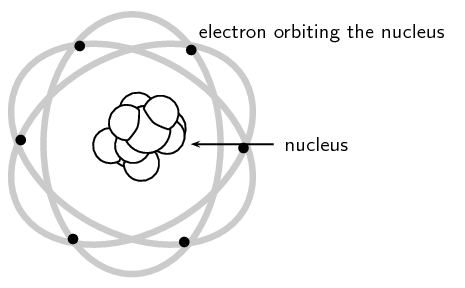

# Teoria atómica

A matéria é formada por átomos, que são partículas extremamente pequenas — tão pequenas que não podemos vê-los diretamente.

Até hoje, ninguém conseguiu observar um átomo individual de forma direta com os olhos, mas os cientistas desenvolveram modelos atômicos para explicar como os átomos são estruturados.

Esses modelos são baseados em evidências experimentais e ajudam a entender o comportamento e a organização dos átomos.

Em 1803, John Dalton propôs o primeiro modelo atômico, baseado em suas leis sobre a matéria. Dalton percebeu que, no universo atômico, átomos não são criados nem destruídos, apenas combinados de diferentes formas.

Ele sugeriu que os átomos tinham as seguintes características:

- Indestrutíveis

- Esféricos

- Maciços

- Homogêneos

- "Indivisíveis"

Mais tarde, em 1898, com a descoberta da carga elétrica do elétron, J.J. Thomson percebeu que os átomos são divisíveis.

Ele concluiu que a massa do átomo era composta por uma carga positiva espalhada, dentro da qual estavam incrustados elétrons de carga negativa, como se fosse um “pudim de passas”.

Mais tarde, em 1911, Ernest Rutherford desenvolveu um dos modelos atômicos mais famosos.
Ele propôs que o átomo é composto por duas regiões principais:

Um núcleo central muito pequeno e denso, com carga positiva.

Uma região ao redor do núcleo, com elétrons (carga negativa) se movendo — e com muito espaço vazio entre eles e o núcleo.

Esse modelo ficou conhecido como o modelo nuclear do átomo.

