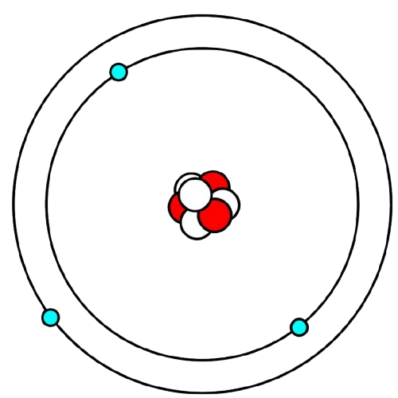

# Mecânica quântica

A mecânica quântica começou a se expandir além da química e chegou à física, especialmente com o trabalho de Niels Bohr em 1913 (pequeno ajuste na data), quando ele desenvolveu seu modelo atômico baseado no modelo de Rutherford. Pode-se dizer que Bohr organizou e quantizou o átomo — ou seja, deu uma estrutura com níveis de energia definidos para os elétrons.

No modelo de Bohr, o átomo é formado por um núcleo central com carga positiva e elétrons que giram ao redor do núcleo em órbitas específicas, chamadas de níveis de energia.

Cada nível de energia comporta uma certa quantidade de elétrons, e quanto mais distante o elétron está do núcleo, maior sua energia e menor sua estabilidade. Ou seja, elétrons mais afastados são mais fáceis de serem removidos e estão em um estado mais instável.